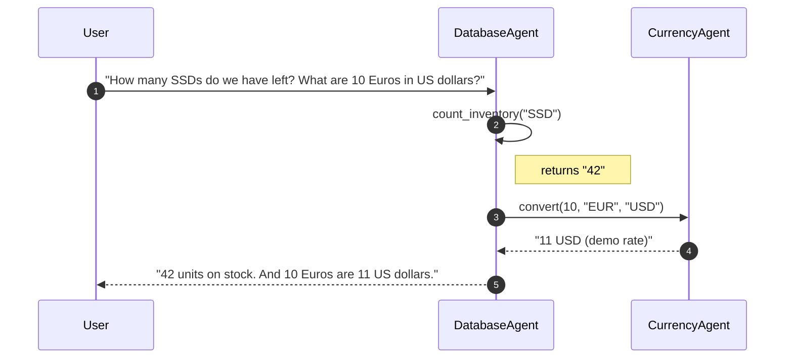
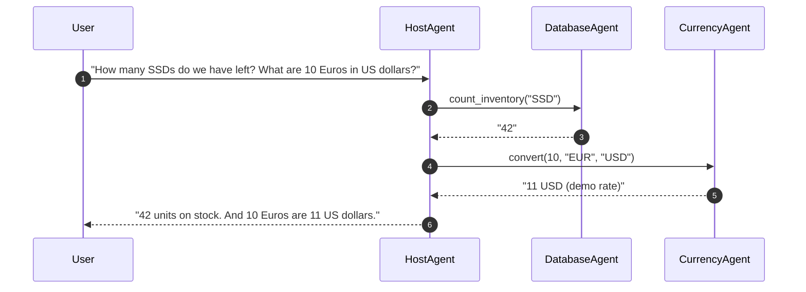
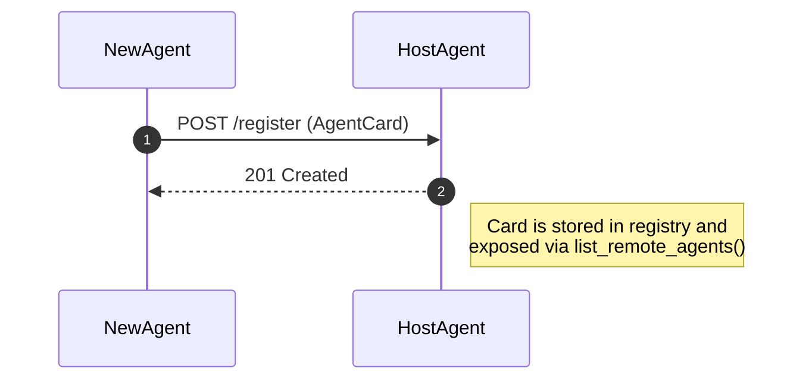

# A2A_bidirectional - Bidirectional task delegation using A2A
## Introduction
This repository provides a small and easy A2A example written in Python where each agent can be both client and server at the same time.
Each of the agents is capable of receiving tasks and delegating it to other agents. Each agent can talk to any peer through the lightweight Agent‑to‑Agent (A2A) JSON‑RPC protocol, and register itself dynamically at run‑time.

The host agent represents an agent registry. Each agent, which will be added to the setup as a new server, receives the host agent address as input argument during the launch.
It calls the host agent during the launch to get registered. Once it has been registered, other agents are able to call this new agent via the host agent without knowing the address of the newly added agent.

---

## ✨ Quick demo

```bash
# 1️⃣ Install – in a fresh venv
pip install -e .
pip install -r requirements.txt

# 2️⃣ Start the registry / router
python -m A2A_bidirectional.agents.host_agent run

# 3️⃣ Spin up some specialists
# One dummy agent which counts inventory in a database
python -m A2A_bidirectional.agents.database_agent chat --peers http://localhost:8000
# One dummy agent which converts currencies
python -m A2A_bidirectional.agents.currency_agent chat --peers http://localhost:8000
```
After the **DatabaseAgent** and **CurrencyAgent** have registered themselves with the **HostAgent** you can chat with any of them and they will seamlessly delegate work to the right peer.

---

## 🖼️ How it works

### 1. Runtime interaction





### 2. Dynamic agent registration



*Any agent can call `register()` **once** on start‑up to make itself discoverable by all other peers.*

---

## 🧩 Repository layout

| Path | What’s inside |
|------|---------------|
| `A2A_bidirectional/agents/` | Ready‑to‑run example agents: **host_agent.py**, **database_agent.py**, **currency_agent.py** |
| `A2A_bidirectional/core/` | `react_agent_factory.py` – creates a LangGraph *ReAct* agent and wires in peer‑communication tools |
| `A2A_bidirectional/server/` | Minimal FastAPI JSON‑RPC server exposing an agent under `/.well‑known/agent.json` and `/` |
| `A2A_bidirectional/utils/` | Utility modules: <br/>• `remote_client.py` – sync JSON‑RPC client, registry handling <br/>• `tool_factories.py` – LangChain Tool wrappers <br/>• `helpers.py` – helper for `serve_and_register()` |
| `requirements.txt` | Reproducible dependency lock‑file |

---

## ➕ Adding a new agent in *3 steps*

1. **Create your internal skills** – plain Python functions decorated with `@tool` (from *LangChain*).
2. **Wrap them in a ReAct agent** using `build_react_agent()` and provide the extra routing rules that explain **when to delegate**.
3. **Expose & register** the agent:
   ```python
   app  = create_app(react_agent, card)
   serve_and_register(app, card, port=8003, host_url="http://localhost:8000")
   ```
   The helper automatically starts the FastAPI server **and** POSTs the `AgentCard` to the HostAgent.

That’s it – all other peers can now call your agent via `send_task(<YourAgentName>, message)` without knowing its IP/port.

---

## 🚀 Why use this framework?

| Benefit | Details |
|---------|---------|
| **Scalable decentral architecture** | Any agent can delegate to any other, avoiding single‑point bottlenecks. |
| **Plug‑and‑play discovery** | Agents self‑register; new capabilities become available at run‑time with zero config changes. |
| **No vendor lock‑in** | Pure Python, standard JSON‑RPC over HTTP; replace LLM/agent implementation freely. |
| **Docker‑ready** | Every example agent is a standalone Python entry‑point → trivial to wrap in a tiny Docker image or deploy as a micro‑service. |
| **LangGraph + ReAct out‑of‑the‑box** | Combines structured tool‑use reasoning with memory, concurrency & streaming if you enable it. |
| **Streamlined DX** | Less than 600 LOC in total, readable and heavily commented code, poetry/flit project metadata. |
| **Observability hooks** | Agent cards expose capabilities (`streaming`, `stateTransitionHistory`) – wire them into tracing/storage back‑ends as needed. |

---

## 🛠️ Configuration

| Variable | Purpose | Default |
|----------|---------|---------|
| `OPENAI_API_KEY` | Needed if you switch to OpenAI models in `react_agent_factory.py` | *none* |
| `MODEL_NAME` | Override the chat model (`gpt‑4o`, `gemma‑2‑it`, …) | `gpt‑4o` |
| `HOST_URL` | URL where the HostAgent is reachable | `http://localhost:8000` |

---
